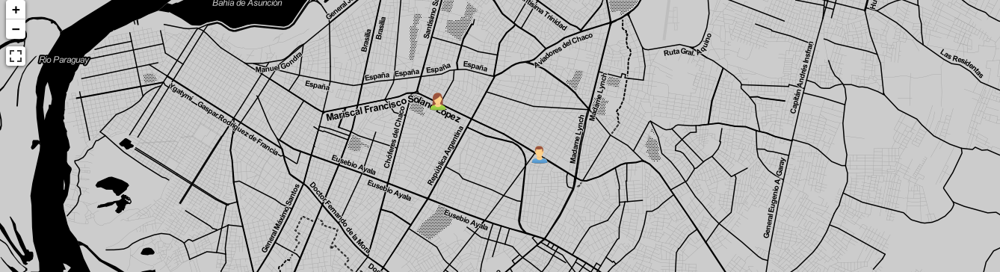
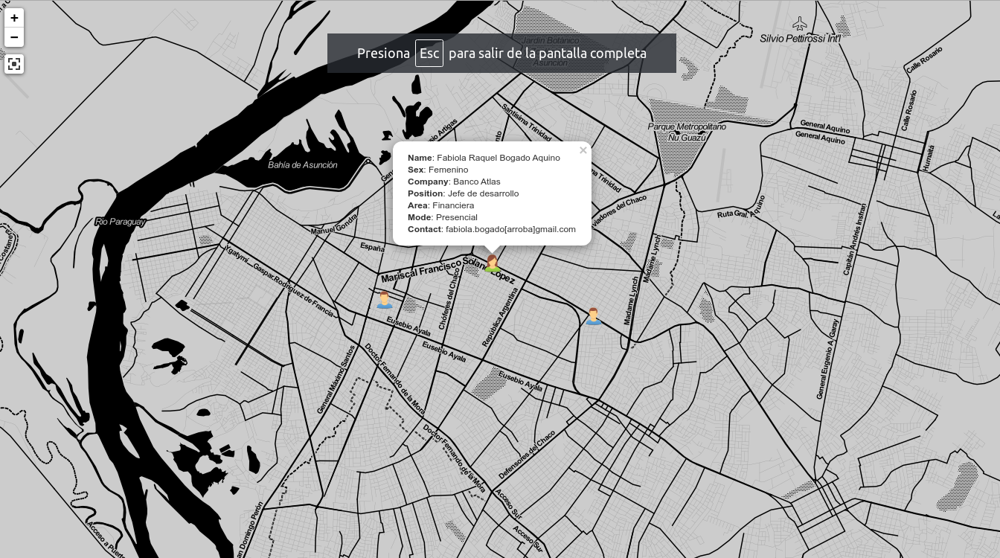

# paraguayos
Sitio para visualizar a todos los Paraguayos que trabajan en el territorio nacional o extranjero en cuanto a áreas de la tecnología de forma remota o presencial. 

## Screenshots

Levantar en sitio en cualquier server (Apache, etc.)
[Sitio de ejemplo] (https://paraguayos.proyectosbeta.net/)

Tecnologías utilizadas:
- JavaScript (Leaflet, JQuery, Boostrap)
- CSS
- HTML
- Datos OSM

Todo list:
- API para consumir los datos.
- Buscador.
- Formulario de carga.
- ~~Visualizaciones.~~
- Versión móvil para Android.
